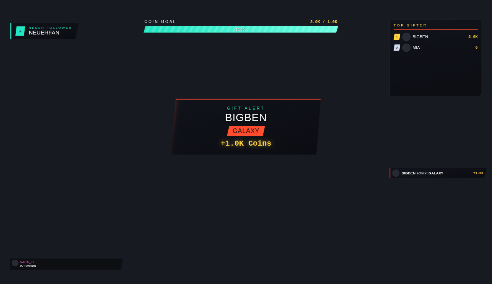
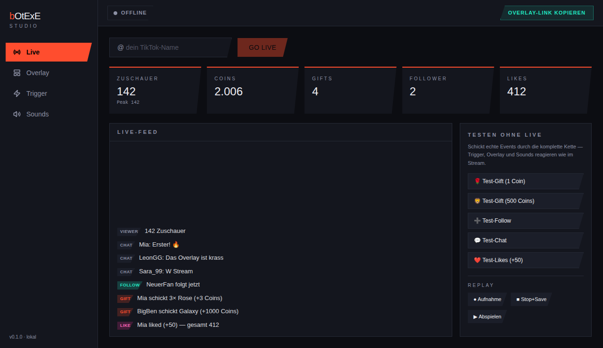
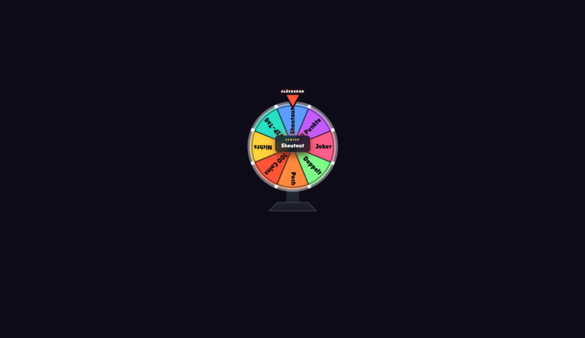
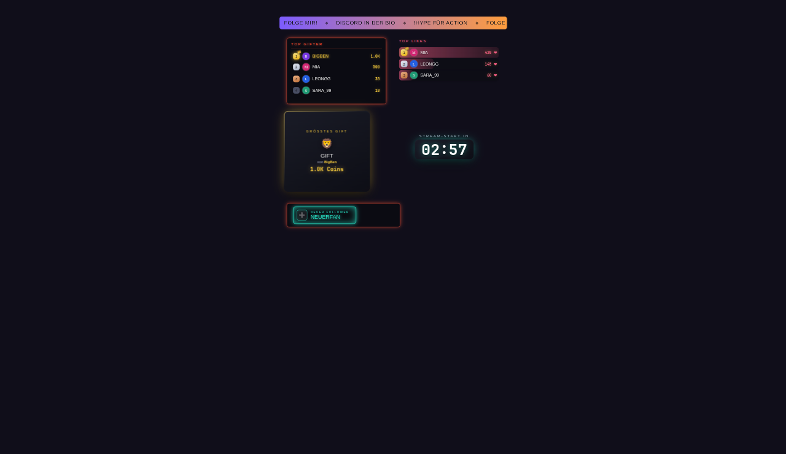
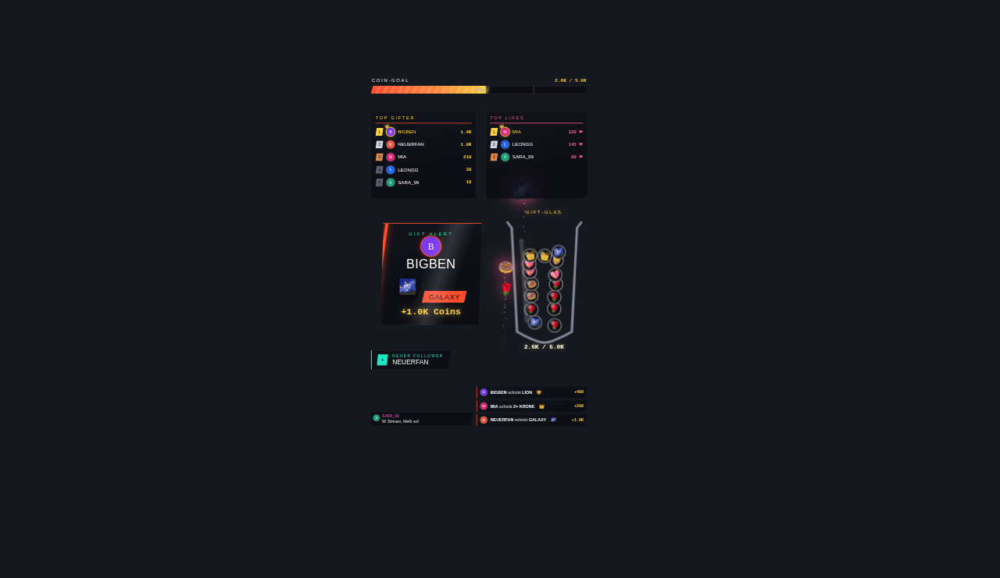

<div align="center">

# bOtExE Studio

**Dein eigenes TikTok-Live Overlay-Studio — kostenlos, lokal, auf deinem PC.**
Ein freier **TikFinity-Ersatz** für Windows: Geschenke, Alerts, Overlays, Sounds, Spiele, TTS, Punkte & Store — alles auf deinem Stream-PC, keine Cloud, keine Abo-Gebühr.

[](https://github.com/dOtExE97/botexe-studio/releases/latest)
&nbsp;
[-f59e0b?style=for-the-badge)](#)



> ⚠️ **ALPHA — das ist KEINE fertige Software!** bOtExE Studio ist eine **frühe Testversion**: Vieles läuft schon, aber es können Fehler auftreten, Sachen sich ändern oder mal abstürzen. Wer's ausprobiert, ist quasi **Test-Pilot** 🧑‍✈️ — und genau dafür gibt's den Knopf *Einstellungen → Fehler melden / Funktion wünschen*. Jedes Feedback & jede Widget-Idee hilft enorm. 🙏 Nutze es vorerst auf eigene Verantwortung, gerne parallel zu deinem bisherigen Setup.
>
> 🤖 **Transparenz:** Gebaut von **dOtExE (Alex)**, gemeinsam „gevibe-coded" mit **Claude (Anthropic)** als KI-Pair-Programmer — Ideen, Richtung & Tests von Alex.

</div>

---

## Was ist das?

Ein Streamer-Tool, das auf dein **TikTok-Live** hört (Geschenke, Follows, Likes, Chat) und daraus schöne **Overlays** für deinen Stream macht — plus Sounds, Spiele, Bestenlisten und mehr. Du baust dir dein Overlay zusammen, kopierst **einen Link** und fügst ihn in **TikTok Live Studio** oder **OBS** als Browser-Quelle ein. Fertig.

### So läuft es (im Groben)
```
Dein TikTok-Live  →  bOtExE Studio (auf deinem PC)  →  ein Overlay-Link  →  TikTok Live Studio / OBS
   Gifts, Follows,      Trigger-Regeln, Widgets,          (transparenter
   Likes, Chat          Sounds, Punkte, Spiele             Overlay-Canvas)
```

## Was kann es?
- 🎁 **Geschenk-Alerts & -Feeds** mit echten TikTok-Gift-Bildern + Profilfotos
- 🏆 **Bestenlisten** (Top-Gifter, Top-Likes, Punkte) im TikFinity-Look
- 🎯 **Trigger**: „Wenn Gift X → spiele Sound / zeig Alert / dreh Glücksrad / …"
- 🎡 **Spiele**: Glücksrad, Bingo, Zahlen-Raten, Geschenk-Schlacht, Live-Umfrage, Giveaway
- 🔥 **Effekte**: Feuerwerk, Herz-Regen, Konfetti, Geschenk-Kanone, Hype-Train
- 🗳️ **Punkte & Store** wie Twitch-Kanalpunkte (Zuschauer sammeln & lösen ein)
- 🗣️ **TTS** — Chat vorlesen & Ansagen (Gratis-Stimme sofort, Premium per eigenem Key)
- 🎨 **30+ Premium-Widgets**, 17 Designs, alles einstellbar — und in der Liste schon **live als Vorschau** sichtbar
- 🔌 **OBS-Steuerung, Stream-Deck, Streamer.bot, Befehle, Sport-Liveticker** u. v. m.

<div align="center">

**Die App (Live-Cockpit):**



**Ein paar schöne Features:**

| Glücksrad | Widget-Designs | Coin-Glas |
|:---:|:---:|:---:|
|  |  |  |

</div>

---

## 📥 Installation
1. **[Neueste Version herunterladen](https://github.com/dOtExE97/botexe-studio/releases/latest)** → `bOtExE Studio Setup.exe`.
2. Starten → installieren. Windows warnt evtl. (unsignierte App) — **das ist normal & safe**, siehe **[Windows-Warnung? 👇](#️-windows-warnt-normal--und-so-gehts)**.
3. **Updates kommen automatisch** (im Hintergrund, beim nächsten Start aktiv). Manuell: *Einstellungen → Auf Update prüfen*.

**Systemanforderungen:** Windows 10 (22H2) oder 11, 64-bit · ~2 GB RAM frei · TikTok Live Studio *oder* OBS. *(Aktuell nur Windows-Build — kein Mac/Linux-Download.)*

## ⚠️ Windows warnt? Normal — und so geht's
Weil die App (noch) kein teures **Signatur-Zertifikat** hat, ist Windows bei einer brandneuen, unbekannten `.exe` erstmal misstrauisch. Das bedeutet **NICHT, dass etwas gefährlich ist** — nur „Windows kennt diesen Herausgeber noch nicht". 🔒 **Warum es safe ist:** der komplette **Code ist hier öffentlich einsehbar** (jeder kann ihn prüfen), die App läuft **lokal** ohne komische Server, und du kannst die `.exe` vor dem Start auf [virustotal.com](https://www.virustotal.com) hochladen und scannen lassen.

Je nach Windows-Einstellung taucht eins davon auf:

**1) „Der Computer wurde durch Windows geschützt" (SmartScreen, blaues Fenster)**
→ Klick **„Weitere Informationen"** → dann erscheint **„Trotzdem ausführen"** → draufklicken. ✅

**2) Datei nach dem Download blockiert**
→ Rechtsklick auf die `Setup.exe` → **Eigenschaften** → ganz unten **„Zulassen"** (engl. „Unblock") anhaken → **OK** → normal starten.

**3) „Smart App Control" blockiert ganz (nur neuere Windows-11-PCs)**
Die strenge neue Funktion lässt unsignierte Apps gar nicht zu. Prüfen/abschalten: **Windows-Sicherheit → App- & Browsersteuerung → Einstellungen für Smart App Control → „Aus"**.
> ⚠️ Achtung: Einmal aus, lässt sich Smart App Control nur per **Windows-Neuinstallation** wieder einschalten — gut überlegen. Bei den meisten PCs ist sie aus oder im „Bewerten"-Modus, dann brauchst du das gar nicht.

*Sobald die App ein Signatur-Zertifikat hat (kommt später), verschwinden diese Warnungen automatisch.*

## 🚀 Erste Schritte
Beim ersten Start führt dich eine kurze **Tour** durch alles (jederzeit wiederholbar: *Einstellungen → Tour erneut zeigen*). Kurzfassung:
1. **Live** → TikTok-Namen eingeben → *Verbinden*. (Oder „Testen ohne Live" für Demo-Events.)
2. **Overlay** → Widgets aus der Palette wählen (du siehst sie live!), aufs Bild legen, einstellen.
3. **Link kopieren** → in TikTok Live Studio (einmalig einrichten) oder OBS als Browser-Quelle.

---

## 🐞 Fehler & 💡 Ideen
Das ist die **Test-Phase** — Feedback ist Gold wert! In der App: *Einstellungen → **Fehler melden** / **Funktion wünschen*** (öffnet ein vorausgefülltes Formular, Version & System sind schon drin). Oder direkt: [Issues](https://github.com/dOtExE97/botexe-studio/issues).

## 💜 Unterstützen
Das Tool ist **kostenlos**. Wenn's dir gefällt: schau in meinem **TikTok-Live** vorbei und gönn mir was 🤝 → [@dotexe_97](https://www.tiktok.com/@dotexe_97). Das hilft mir, weiter dran zu bauen.

## 🔒 Datenschutz & Sicherheit
**Lokal-first:** Deine Daten (TikTok-Session fürs Chat-Senden, OBS-/TTS-Zugänge, Punkte, Overlays) bleiben **auf deinem PC**. Ausnahmen: **Cloud-TTS** schickt den vorzulesenden Text an den Stimmen-Anbieter, und das **Auto-Update** fragt bei GitHub nach neuen Versionen. Sicherheitslücken bitte **privat** melden → [`SECURITY.md`](SECURITY.md).

---

## 🛠️ Für Entwickler
Monorepo (npm workspaces), Electron + Vite + TypeScript, React-Renderer, Vanilla-ES-Module-Widgets.

```bash
npm install            # einmalig
npm run dev:desktop    # Dev-Modus
npm test               # alle Tests (node:test + tsx)
npm run lint           # eslint   ·   npm run typecheck   ·   npm run build:desktop
```

```
apps/desktop/src/{main,renderer,shared}   ← Electron-App (Logik · UI · Typen)
packages/{overlay-engine,widget-kit,trigger-engine}   ← Overlay-Runtime · Widgets · Regel-Logik
```

**Release:** Version in beiden `package.json` bumpen, committen, dann `git tag v0.X.0 && git push origin v0.X.0` → CI baut & veröffentlicht die Setup.exe (Auto-Update-Feed via GitHub-Releases). Mehr: [`CHANGELOG.md`](CHANGELOG.md).

## Lizenz
**Source-available, kein Open Source.** Der Code ist öffentlich einsehbar (Transparenz + Audit), und du darfst die offiziellen Builds fürs eigene Streaming nutzen — aber **nicht** kopieren, weiterverbreiten oder ein eigenes/kommerzielles Produkt daraus bauen. Alle Rechte bei dOtExE. Kommerzielle/Agentur-Lizenzen auf Anfrage. Details: [`LICENSE`](LICENSE).
